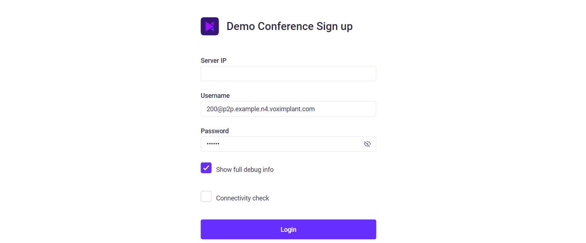
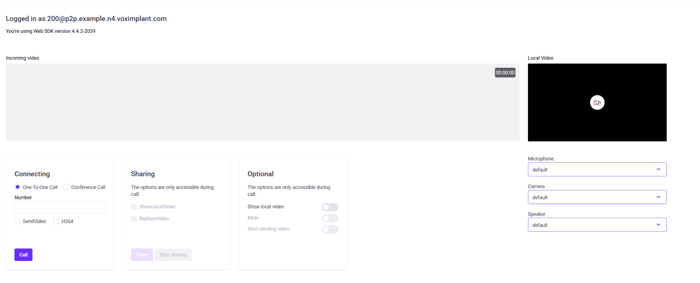

# Basic WebSDK demo

[](https://github.com/standard/standard)

Это приложение показывает большинство базовых техник и рекомендаций для работы с видеозвонками через WebSDK Voximplant.
Для простоты работы приложение выполнено на vanilla js.

Экран логина


Экран подготовки к звонку


## Основные показанные функции
- call 
- conference 
- simulcast (для версии sdk 4.5+)
- управление приемом media для simulcast (для версии sdk 4.5+)
- Трансфер звонка
- отправка DTMF
- Демонстрация экрана
- Работа с VoxImplant.Hardware

## Как использовать DTMF
При активном звонке используйте клавиши `0`, `1`, `2`, `3`, `4`, `5`, `6`, `7`, `8`, `9`, `*`, `#` на основной или дополнительной клавиатуре.

## Как использовать API управление приемом media для simulcast
Для того чтобы получить базовую информацию о работе с simulcast API пожалуйста, [прочитайте статью](тут должна быть ссылка на доку по симулкасту)

### Включение/выключение приема потоков
- Для того чтобы перестать принимать поток, нажмите на видео, которое хотите перестать принимать
- Для того чтобы начать принимать поток, нажмите на видео повторно

### Изменение максимально доставляемого разрешения видео
- Для того чтобы снизить размер запрашиваемого видео вдвое, надо Ctrl+LeftClick или Alt+LeftClick по целевому видео   
- Для того чтобы сбросить размер запрашиваемого видео, надо сделать Shift+Ctrl+LeftClick или Shift+Alt+LeftClick по целевому видео

## Выбор версии WebSDK
По умолчанию, в данной демке используется latest версия voximplant-websdk. Для того, чтобы подключить `voximplant-websdk@4.5` найдите следующую строку в index.html 
```html
<script src="https://unpkg.com/voximplant-websdk"></script>
```
замените ее на 
```html
<script src="https://unpkg.com/voximplant-websdk@beta"></script>
```