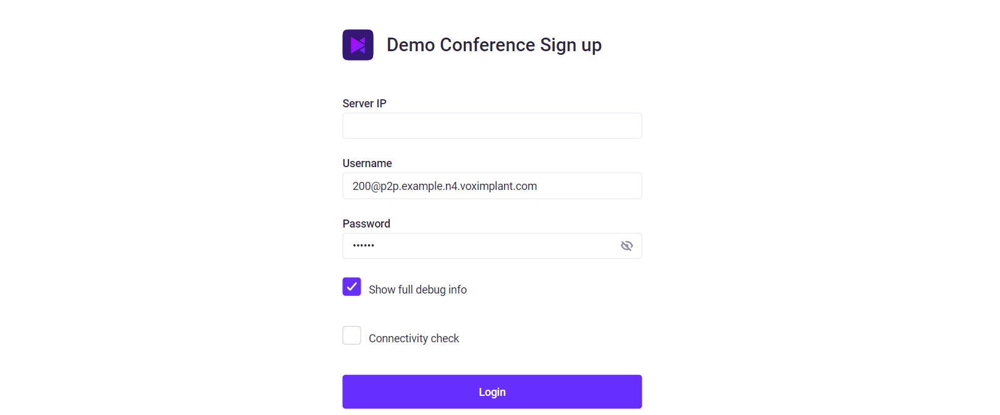
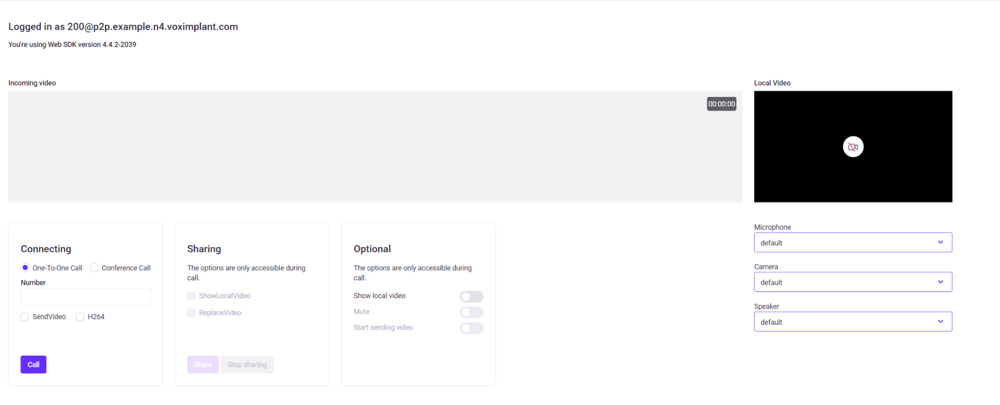

# Basic WebSDK demo

[](https://github.com/standard/standard)

This demo explains basic concepts and recommendations for Voximplant's Web SDK video conferencing.  
The demo is based on Vanilla JS for the ease of working.

**Login Screen**


**Preparing for a call**


## This demo shows the following features

- Calls
- Conferencing
- Simulcast (SDK v4.5 and above)
- Managing incoming media quality in Simulcast (SDK v4.5 and above)
- Call transfers
- DMTF sending
- Screen sharing
- Working with Voximplant.Hardware

## How to send DTMF

Use the keyboard/keypad `0`, `1`, `2`, `3`, `4`, `5`, `6`, `7`, `8`, `9`, `*`, `#` keys to send DTMF while the call/conference is active.

## How to manage media quality with Simulcast

Please read the [How to manage video quality](https://voximplant.com/docs/howtos/conference/simulcast) article in our documentation to learn about Simulcast usage.

### How to start/stop an incoming media

- To stop an incoming video/media, just click on the video frame that you do not want to receive
- To start the incoming video/media, click on the video frame again

### How to change an incoming video quality

- To lower an incoming video resolution, perform a Ctrl+LeftClick or Alt+LeftClick on the target video
- To reset an incoming video resolution, perform a Shift+Ctrl+LeftClick or Shift+Alt+LeftClick on the target video

## How to change SDK version

This demo uses the latest SDK version by default. If you want to change the SDK version to `voximplant-websdk@4.5`, find the following line in the index.html file:

```html
<script src="https://unpkg.com/voximplant-websdk"></script>
```

And change it to:

```html
<script src="https://unpkg.com/voximplant-websdk@beta"></script>
```
